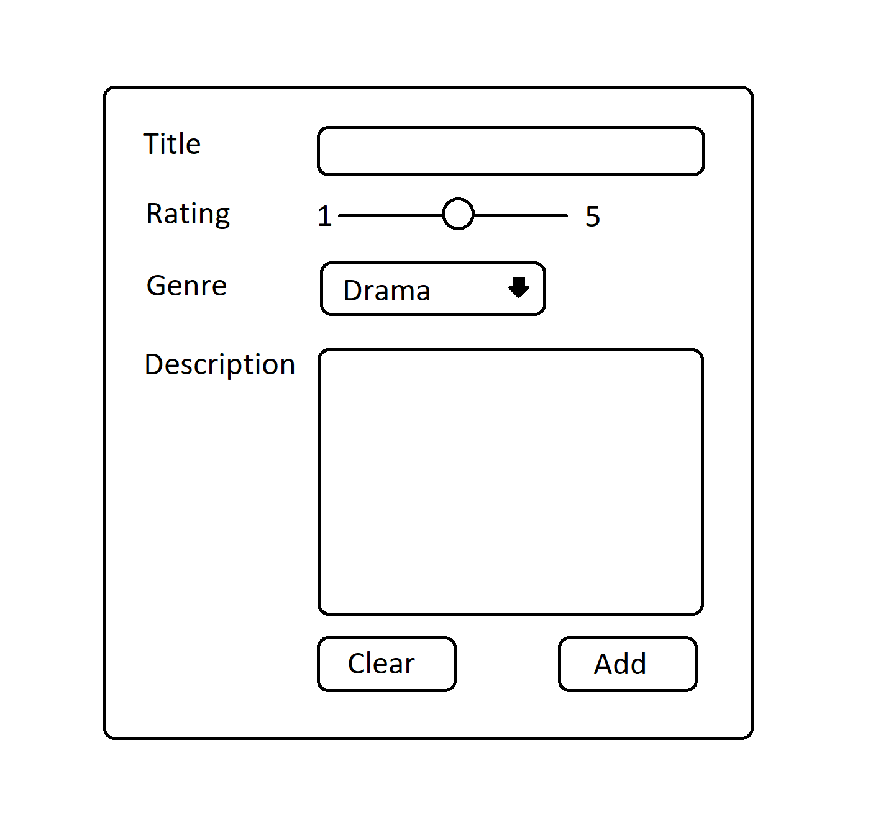
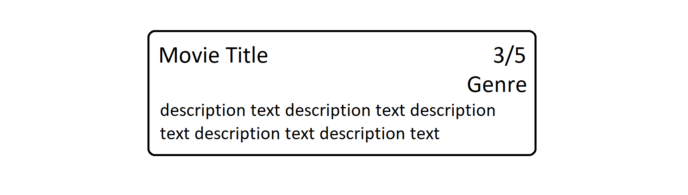

# Movie Cards

Table of content

- [Regular version](#regular-version)
- [Edited version that includes Context](#edited-version-including-context)

You are going to create a webpage where you can add movie cards. This will be done through a form, where the user can type in a title, rating, genre and a description.

The image at the bottom of this article is just a wireframe, your application should resemble that one but you can _( should? )_ take it to the next level.

<figure style=" margin: 0; text-align: center">
  <figcaption>AddMovie</figcaption>
  
</figure>

[Back to the top](#movie-cards)

## Requirements of the application

- **Title**, is an `<input>` field of the type text.
- **Rating**, is an `<input>` of the type range.
- **Genre**, is a `select` element with several `<option>` _( dropdown )_.
- **Description**, is a `<textarea>`.

[Back to the top](#movie-cards)

## Regular version

### Instructions

- This exercise must be completed with React and Vite.

1. Create a component for `<AddMovie>` with JSX that includes the input fields and buttons from the first image.

2. I `<AddMovie>`, connect the fields to variabels and do a `console.log()` on these when you click "Add".

3. Put all these variabels in an object and log it to the console.

4. Create a component, `<MovieCard>` that has JSX like the second image.

5. In `<MovieCard>`, add props and connect them to the different parts of the JSX.

6. Render one `<MovieCard>`, that takes one movie object from `<AddMovie>` as props, under the `<AddMovie>` component when you click "Add".

7. Add every movie object, that is created, to an array and render a `<MovieCard>` for every movie object with a map-function. Put them under the `<AddMovie>` component.

8. Create another component, `<MovieList>` that renders out a list of `<MovieCard>`. It should take a prop that contains the array of movie object. Use this component instead of the individual `<MovieCard>`.

9. When you click on a `<MovieCard>` it should be deleted from the array. React will handle the rerendering of the DOM.

  <figcaption>MovieCard</figcaption>
  

[Back to the top](#movie-cards)

## Edited version including Context

This version of the exercise includes the creating of a Context to own and handle the data manipulation.

Follow the same instructions as the regular version, but instead of passing around props, you set aside all the data inside a `MovieCardContext` instead. The `MovieCardContext` will hold the movie card list, and the logic to update it. You the must wrap you application with the the `MovieCardContext` and use `useContext` inside every component that 'subscribes' to the Context.

Check my example from today's lecture for instructions on how to create it or try it on your own with the help of documentation from the internet.

her is the repo from today _( 20250303 )_: [Today's repo](https://github.com/jensen-frontend-2024/2025-03-03-context-API)